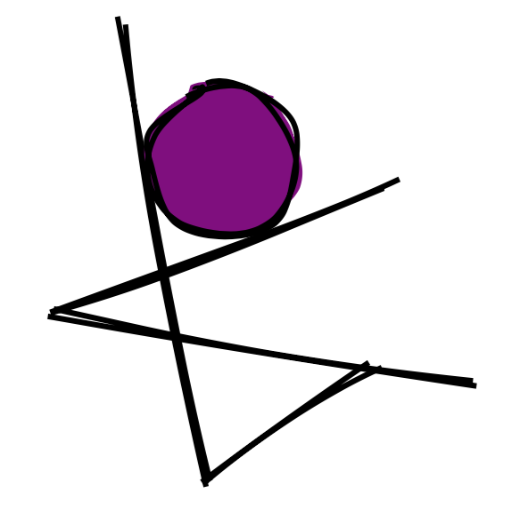

# danceON (dance Object Notation)
https://dancinganddabbing.github.io/danceON/

danceON is a creative coding environment for making dance videos with animations. It  is developed by researchers at NYU and collaborators at [STEM From Dance](https://www.stemfromdance.org) as part of the [Dancing Across Boundaries (DAB!)](https://www.kayladesportes.com/project/dab/) project.

Read our CHI paper [danceON: Culturally Responsive Creative Computing](https://doi.org/10.1145/3411764.3445149)

[Watch a video of a final student group project.](https://www.youtube.com/watch?v=g4VqEy9bPE0&authuser=1)

## Development
Simply fire up a local server and open in your browser of choice. On macs, the command is:
```bash
$ python -m SimpleHTTPServer
```

## Tools
danceON is built on the following libraries and resources:
* [p5.js](https://p5js.org): canvas animations
* [BlazePose](https://google.github.io/mediapipe/solutions/pose.html): pose detection in browsers
* [Ace Editor](https://ace.c9.io)
* Syntax theme is custom, but based on [Night Owl Theme by Sarah Drasner](https://marketplace.visualstudio.com/items?itemName=sdras.night-owl)
* [Bulma](https://bulma.io): CSS Framework
* [Space Mono](https://fonts.google.com/specimen/Space+Mono): Logo and editor font


## Example Code
danceON uses a declarative syntax for binding shapes and animations to body parts. The following example shows off some of danceON's syntax. Many more examples are embedded in the application itself.


```javascript
(pose, poseHistory) => [
    {
        what: 'circle',
        when: true,
        where: {
            x: pose.leftWrist.x,
            y: pose.leftWrist.y,
        },
        how: {
            d: [30, 60, 80],
            fill: 'rgba(0,0,255, 0.25)',
            stroke: 50
        }
    },
    {
        what: 'circle',
        when: pose.rightWrist.y < pose.rightHip.y,
        where: {
            start: {
                x: pose.rightWrist.x,
                y: pose.rightWrist.y,
                velocityX: random(-12, -7),
                velocityY: random(-0.6, 0.6)
            },
            accelerationX: 0,
            accelerationY: 0
        },
        how: {
            d: [{frame: 0, value: 0}, {frame: 30, value: 30}],
            fill: 'rgba(255,0,0, 0.25)',
            stroke: 50
        }
    }
];

```

---


